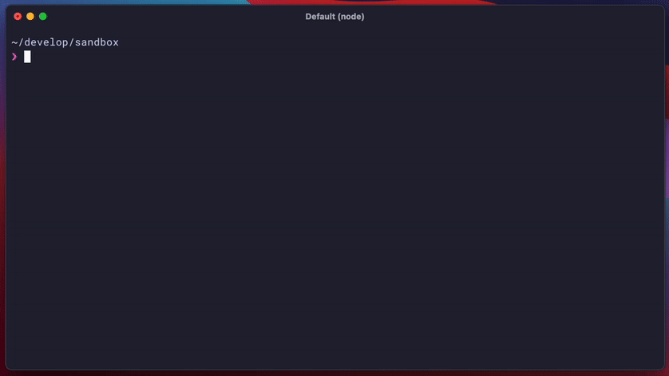

[](https://github.com/acot-a11y/acot/actions?workflow=CI)
[](./LICENSE)

---

<p align="center">
  <strong>!! THE ACOT IS STILL IN ALPHA STATUS AND MAY BE BROKEN BY THE UPGRADE !!</strong>
</p>

---

## Overview

> More accessible web, all over the world.

`acot` is an open-source Accessibility Testing Framework that uses headless Chrome ([puppeteer](https://github.com/puppeteer/puppeteer)) to provide a means of testing any website or web app. It support for making the Web accessible with a flexible, highly reliable rule set that leverages browser-native APIs such as the AOM and DOM.

### Reliability

- By using the results rendered by the browser, a highly reliable audit is possible.
- `acot` provides original rules. In addition, it offers rules based on the proven [axe](https://github.com/dequelabs/axe-core).

### Extensibility

- You can use the rules published in the [ESLint](https://eslint.org/) Like plugin system.
- It's easy to implement and publish the rule sets you need for your team.
- The divided packages allow you to assemble a custom workflow that works best for your team.

### Portability

- You can create and publish your own configuration with Sharable Config.
- Provides Custom Runner for integration with Storybook.

## Getting Started

Install via npm:

```bash
$ npm install --save-dev @acot/cli

# or

$ npm install --save-dev @acot/cli puppeteer
```

You can build the configuration file and install the dependent packages with the following commands:

```bash
$ npx acot init
```



And then, The `run` subcommand performs an audit based on the configuration file.

```bash
$ npx acot run
```

See the [CLI documentation](packages/cli) for details.

## Requirements

- Node.js 12.10.0+ (require [Promise.allSettled](https://developer.mozilla.org/en-US/docs/Web/JavaScript/Reference/Global_Objects/Promise/allSettled))
- Puppeteer 5.4.0+ (require [aria handler](https://github.com/puppeteer/puppeteer/releases/tag/v5.4.0))

## How does it work?

_T.B.A_

## Packages

`acot` has a feature which is divided into several packages.

### Foundations

| Package                            | Version                                                                                                           | Description                             |
| :--------------------------------- | :---------------------------------------------------------------------------------------------------------------- | :-------------------------------------- |
| [@acot/core](./packages/core/)     | [](https://www.npmjs.com/package/@acot/core)     | acot core API.                          |
| [@acot/cli](./packages/cli/)       | [](https://www.npmjs.com/package/@acot/cli)       | acot command line tool.                 |
| [@acot/config](./packages/config/) | [](https://www.npmjs.com/package/@acot/config) | A module to manipulate configs of acot. |

### Configs / Presets

| Package                                                | Version                                                                                                                               | Description                     |
| :----------------------------------------------------- | :------------------------------------------------------------------------------------------------------------------------------------ | :------------------------------ |
| [@acot/acot-config](./packages/acot-config/)           | [](https://www.npmjs.com/package/@acot/acot-config)           | A basic acot rule set.          |
| [@acot/acot-preset-wcag](./packages/acot-preset-wcag/) | [](https://www.npmjs.com/package/@acot/acot-preset-wcag) | A WCAG-based rule set for acot. |
| [@acot/acot-preset-axe](./packages/acot-preset-axe/)   | [](https://www.npmjs.com/package/@acot/acot-preset-axe)   | An axe rule set for acot.       |

### Runners

| Package                                                          | Version                                                                                                                                         | Description                                                                      |
| :--------------------------------------------------------------- | :---------------------------------------------------------------------------------------------------------------------------------------------- | :------------------------------------------------------------------------------- |
| [@acot/acot-runner-storybook](./packages/acot-runner-storybook/) | [](https://www.npmjs.com/package/@acot/acot-runner-storybook) | An acot custom runner for [Storybook](https://github.com/storybookjs/storybook). |

### Utilities

| Package                                                | Version                                                                                                                               | Description                                                                          |
| :----------------------------------------------------- | :------------------------------------------------------------------------------------------------------------------------------------ | :----------------------------------------------------------------------------------- |
| [@acot/find-chrome](./packages/find-chrome/)           | [](https://www.npmjs.com/package/@acot/find-chrome)           | Find Chrome available in your runtime environment.                                   |
| [@acot/html-pickup](./packages/html-pickup/)           | [](https://www.npmjs.com/package/@acot/html-pickup)           | Use the CSS Selector to pick up the elements from the HTML string.                   |
| [@acot/schema-validator](./packages/schema-validator/) | [](https://www.npmjs.com/package/@acot/schema-validator) | A simple wrapper module for [schema-utils](https://github.com/webpack/schema-utils). |

## FAQ

_T.B.A_

## Contributing

We are always welcoming your contribution :clap:

See [CONTRIBUTING.md](./CONTRIBUTING.md).

## License

[MIT © wadackel](./LICENSE)
