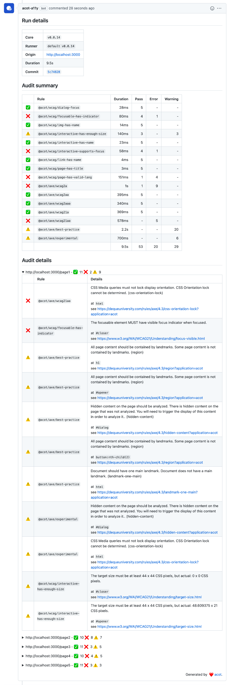

# @acot/acot-reporter-github

GitHub reporter for `@acot/cli`.



## Examples

- [acot-a11y/example-github-reporter](https://github.com/acot-a11y/example-github-reporter)

## Installation

Install via npm:

```bash
$ npm install --save @acot/acot-reporter-github
```

## Prerequisites

There are a few necessary setups for integrating acot with GitHub.

1. Install the [acot-a11y GitHub App](https://github.com/apps/acot-a11y) in the repository where you want to use GitHub integration.
1. Generate a token for GitHub integration from the [token manager application](https://gh-app.acot.dev).

## Usage

```javascript
module.exports = {
  reporters: [
    {
      use: '@acot/github',
      with: {
        token: '...',
      },
    },
  ],
};
```

### Pass the token as an environment variable

If you pass a token to the `ACOT_GITHUB_APP_TOKEN` environment variable, the GitHub reporter will automatically resolve the token for you. It is one technique to avoid writing the token directly into the configuration file.

```javascript
module.exports = {
  reporters: ['@acot/github'],
};
```

### Enabling debug logging

If you need logging other than errors, enabling the `debug` option will help.

```javascript
module.exports = {
  reporters: [
    {
      use: '@acot/github',
      with: {
        debug: true,
      },
    },
  ],
};
```
